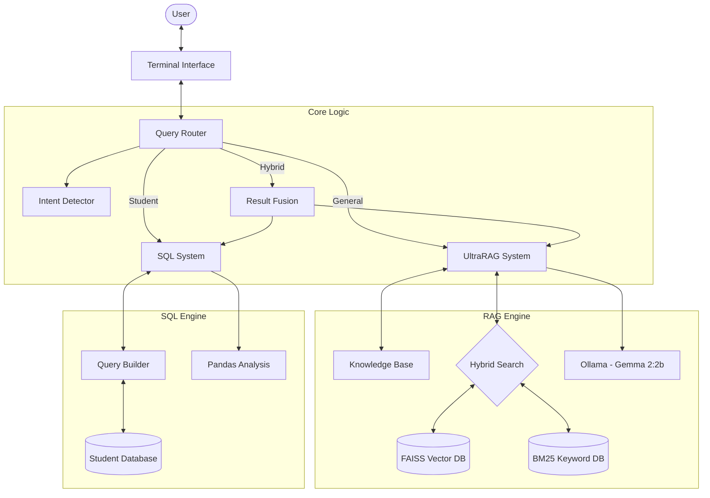
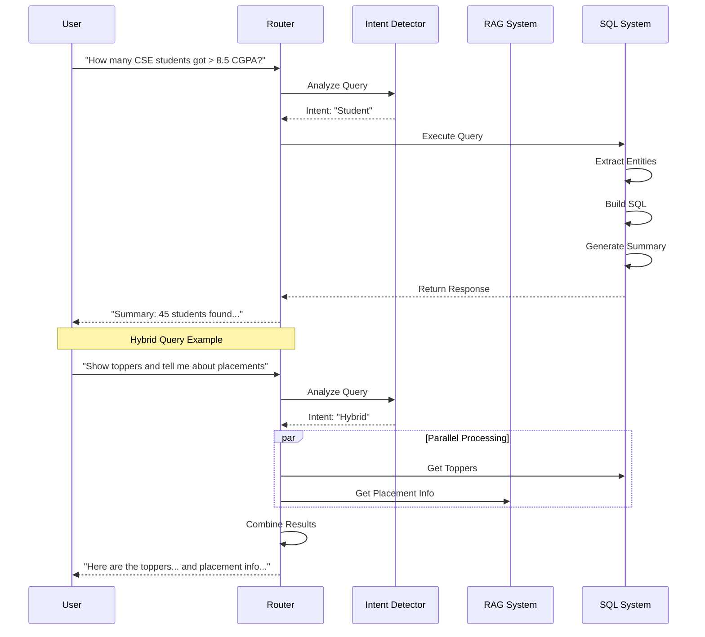

# College Buddy - AI Powered Campus Assistant

## Overview
College Buddy is an intelligent conversational AI designed to assist students, faculty, and visitors of TKRCET. It features a advanced **Hybrid RAG-SQL System** that intelligently routes queries between a semantic search engine (for general college info) and a structured SQL database (for student analytics).

## Key Features
- 🧠 **Hybrid Architecture**: Intelligently routes queries to either **UltraRAG** (general info) or **SQL System** (tabular data).
- 📊 **Student Data Analysis**: Can answer complex queries about student performance, placements, and departments (e.g., "List top 5 companies", "How many students got > 8.5 CGPA?").
- 🤖 **Efficient LLM**: Powered by **Gemma 2:2b** via Ollama, optimized for speed on local hardware.
- 🛡️ **Scope Validation**: Built-in filtering to reject non-college queries.
-  **Knowledge Base**: Instant answers for critical facts (personnel, timings, location).
- ⚡ **Fast & Lightweight**: Runs efficiently on local hardware with minimal memory footprint.

## Tech Stack
- **Language**: Python 3.8+
- **LLM**: Google Gemma 2:2b (via Ollama)
- **Embeddings**: all-MiniLM-L6-v2
- **Vector DB**: FAISS + BM25 (Hybrid Search)
- **Structured DB**: SQLite + Pandas (for Student Data)
- **Routing**: Regex-based Intent Detection
- **Backend**: FastAPI (optional web server)

## Prerequisites
- **OS**: Windows, Linux, or macOS
- **Python**: 3.8 - 3.11
- **RAM**: Minimum 8GB recommended
- **Software**: 
  - [Ollama](https://ollama.com/) (Required)
  - [Git](https://git-scm.com/)

## Setup Instructions

### 1. Clone the Repository
```bash
git clone https://github.com/VijayKiran-2004/college-buddy.git
cd college-buddy
```

### 2. Create Virtual Environment
```bash
# Windows
python -m venv .venv
.venv\Scripts\activate

# Linux/Mac
python3 -m venv .venv
source .venv/bin/activate
```

### 3. Install Dependencies
```bash
pip install -r requirements.txt
```

### 4. Configure Ollama (Critical)
1. Install [Ollama](https://ollama.com/).
2. Pull the model:
   ```bash
   ollama pull gemma2:2b
   ```
3. Keep Ollama running in the background (`ollama serve`).

### 5. Run the Chatbot
You can run the chatbot in two modes:

**Mode A: General Chat (RAG Only)**
```bash
python terminal_chat.py
```

**Mode B: Hybrid System (RAG + SQL)**
*Recommended for full functionality*
```bash
python terminal_chat_hybrid.py
```

## Usage Examples

### 🏢 General Queries (RAG)
- "Who is the principal?"
- "What are the college timings?"
- "Tell me about CSE department facilities."
- "How do I apply for admission?"

### 🎓 Student Data Queries (SQL)
- "List all students in CSE department"
- "Show students with CGPA > 8.5"
- "Who are the top recruiters?"
- "How many students got placed in TCS?"
- "What is the average CGPA of ECE students?"

### 🔄 Hybrid Queries
- "Show students with > 9.0 CGPA and tell me about the placement cell."

## Architecture

### System Architecture
The College Buddy system follows a hybrid architecture combining Retrieval-Augmented Generation (RAG) with Structured Query Language (SQL) capabilities.



### Data Flow
How a user query is processed and answered:



## Project Structure
```
college-buddy/
├── app/
│   ├── services/
│   │   ├── ultra_rag.py           # General Info Engine (RAG)
│   │   ├── sql_system.py          # Student Data Engine (SQL)
│   │   ├── intent_detector.py     # Router Logic
│   │   ├── query_router.py        # Main Controller
│   │   └── chain.py               # Chain-of-Thought handling
│   ├── database/
│   │   ├── students.db            # SQLite Student DB
│   │   └── vectordb/              # FAISS/BM25 Indices
│
├── terminal_chat.py               # RAG-only interface
├── terminal_chat_hybrid.py        # Full Hybrid interface (Recommended)
├── requirements.txt               # Dependencies
└── README.md                      # Documentation
```

## Privacy & Security
- **Student Data**: The SQL system is designed to provide *aggregate* summaries for general queries (e.g., "count of students") to protect privacy. Individual records are only shown for specific ID lookups.
- **Local Processing**: All data stays on your local machine.

## Team
- **Vijay Kiran**: System Architecture
- **Sanjana**: Data Pipeline
- **Subhash Chandra**: Database
- **Sathish**: Vector Optimization
- **Mokshagna**: LLM Integration
- **Vishnuvardhan**: Prompt Engineering
- **Praneetha**: Testing

---
**Version**: 2.1 (Hybrid Edition)
**Status**: Production Ready ✅
