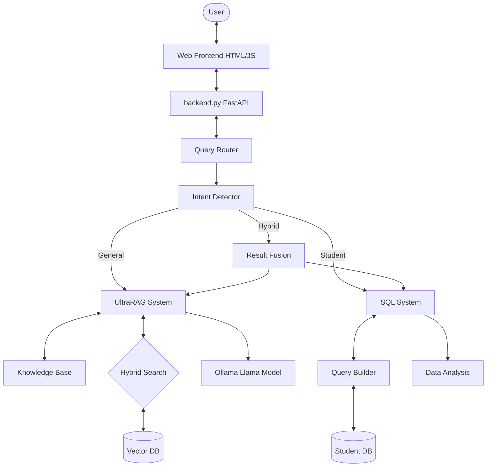
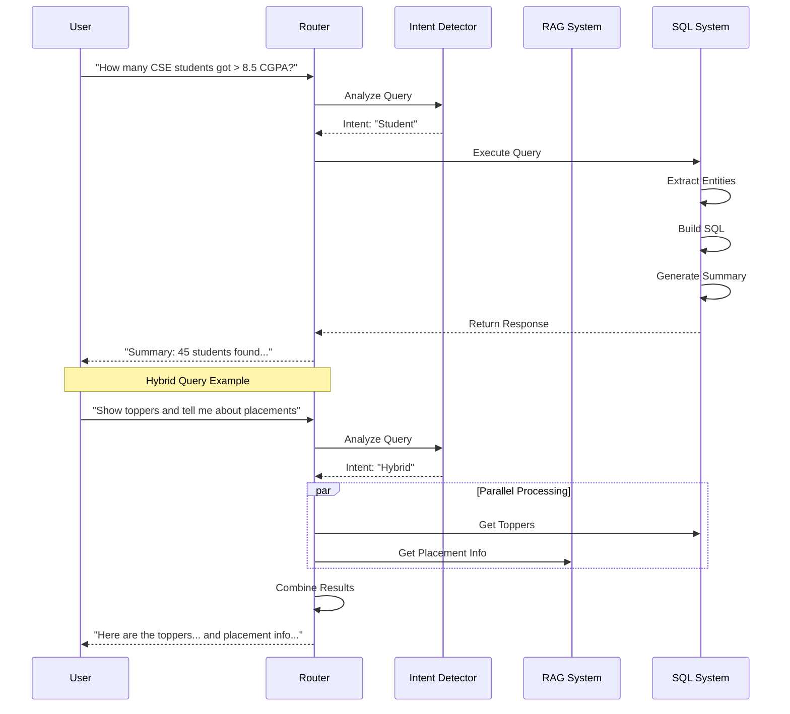

# College Buddy - AI Powered Campus Assistant

## Overview
College Buddy is an intelligent conversational AI designed to assist students, faculty, and visitors of TKRCET. It features a advanced **Hybrid RAG-SQL System** that intelligently routes queries between a semantic search engine (for general college info) and a structured SQL database (for student analytics).

## Key Features
- 🧠 **Hybrid Architecture**: Intelligently routes queries to either **UltraRAG** (general info) or **SQL System** (tabular data).
- 📊 **Student Data Analysis**: Can answer complex queries about student performance, placements, and departments (e.g., "List top 5 companies", "How many students got > 8.5 CGPA?").
- 🤖 **Efficient LLM**: Powered by **Llama 3.2:3b** via Ollama, optimized for speed on local hardware.
- 🛡️ **Scope Validation**: Built-in filtering to reject non-college queries.
-  **Knowledge Base**: Instant answers for critical facts (personnel, timings, location).
- ⚡ **Fast & Lightweight**: Runs efficiently on local hardware with minimal memory footprint.
- 🗣️ **Natural Conversations**: Varied, friendly responses for common queries to avoid robotic answers.
- 🔗 **Navigation Links**: Responses include clickable link chips to relevant TKRCET website pages.
- 🌐 **Web Frontend**: Browser-based chat interface with SSE streaming, dark mode, voice I/O, and multi-language support.
- 📋 **Dual-Sheet Logging**: Every production query is logged to `logs/response_log.xlsx` (Production sheet). Evaluation runs write full quality metrics to the Evaluation sheet — with both client-side Latency and server-side Time Taken recorded side-by-side.
- 📄 **Metrics Reference PDF**: Auto-generated `logs/Metrics_Reference.pdf` documents every metric with formulas, plain-English explanations, and color-coded score bands.

## Tech Stack
- **Language**: Python 3.8+
- **LLM**: Llama 3.2:3b (via Ollama)
- **Embeddings**: all-MiniLM-L6-v2
- **Vector DB**: ChromaDB (Semantic Search)
- **Structured DB**: SQLite + Pandas (for Student Data)
- **Routing**: Gemma 3 1B (intent routing) + Semantic Similarity (embeddings-based fallback)
- **SQL Safety**: Built-in safety filter blocks destructive queries (DROP, DELETE, etc.)
- **Backend**: FastAPI with SSE streaming
- **Frontend**: HTML/CSS/JS with Tailwind CSS, Marked.js

## Prerequisites
- **OS**: Windows, Linux, or macOS
- **Python**: 3.9 - 3.11
- **RAM**: Minimum 8GB recommended
- **Software**: 
  - [Ollama](https://ollama.com/) (Required)
  - [Git](https://git-scm.com/)
  - **Google Chrome** or **Chromium** (Required for Data Scraping)

## Setup Instructions

### 1. Clone the Repository
```bash
git clone https://github.com/VijayKiran-2004/College-Chat-Bot.git
cd College-Chat-Bot
```

### 2. Create Virtual Environment
> [!IMPORTANT]
> You **MUST** go into the project folder first!
> ```bash
> cd College-Chat-Bot
> ```.\.venv\Scripts\Activate.ps1

```bash
# Windows (PowerShell)
python -m venv .venv


# Linux/Mac
python3 -m venv .venv
source .venv/bin/activate
```
*Note: If you see a security error in PowerShell, run `Set-ExecutionPolicy Unrestricted -Scope Process` first.*
```

### 3. Install Dependencies
```bash
pip install -r requirements.txt
```

### 4. Configure Ollama (Critical)
1. Install [Ollama](https://ollama.com/).
2. Pull the required models:
   ```bash
   ollama pull llama3.2:3b
   ollama pull gemma3:1b
   ```
3. Keep Ollama running in the background (`ollama serve`).

### 5. Data Setup (Crucial Step)
Since raw data is not checked into git, you must generate it locally:

**A. Scrape College Data (Web)**
```bash
python scripts/tkrcet_scraper.py
```
*Advanced AI-powered scraper using Playwright and Groq API. Extracts 80+ pages with structured semantic cleaning. Requires Chrome.*

**B. Generate Unified Vectors**
```bash
python scripts/generate_vectors.py
```
*Chunks and combines scraped data + FAQ data into `unified_vectors.json`.*

### 6. Ingest Data (Vector DB)
Now, process the data into the Vector Database:
```bash
python scripts/ingest.py
```
*(This populates the `college_data` ChromaDB collection)*

**Generate Knowledge Corpus:**
```bash
python scripts/corpus_converter.py
```
*(Generates the JSONL corpus required for UltraRAG)*

### 7. Run the Chatbot

**Option A: Backend API Server (Recommended)**
Start the REST API server to power frontend applications:
```bash
python backend.py
```
*Server runs at `http://127.0.0.1:8000`*

## Usage Examples

### 🏢 General Queries (RAG)
- "Who is the principal?"
- "What are the college timings?"
- "Tell me about CSE department facilities."
- "How do I apply for admission?"

### 🎓 Student Data Queries (SQL)
- "List all students in CSE department"
- "Show students with CGPA > 8.5"
- "Who are the top recruiters?"
- "How many students got placed in TCS?"
- "What is the average CGPA of ECE students?"

### 🔄 Hybrid Queries
- "Show students with > 9.0 CGPA and tell me about the placement cell."

## Architecture

### System Architecture
The College Buddy system follows a hybrid architecture combining Retrieval-Augmented Generation (RAG) with Structured Query Language (SQL) capabilities.



### Data Flow
How a user query is processed and answered:



## Project Structure
```
college-buddy/
├── app/
│   ├── services/
│   │   ├── ultra_rag.py           # General Info Engine (RAG) + Topic Links
│   │   ├── sql_system.py          # Student Data Engine (SQL + Safety Filter)
│   │   ├── intent_detector.py     # Embeddings-based Intent Routing
│   │   ├── query_router.py        # Main Controller
│   │   ├── logger_service.py      # Excel log writer (Production + Evaluation sheets)
│   │   └── chain.py               # Chain-of-Thought handling
│   ├── config/
│   │   └── ultrarag_config.yaml   # RAG system configuration
│   ├── database/
│   │   ├── students.db            # SQLite Student DB
│   │   └── vectordb/              # ChromaDB Storage + Corpus
│
├── scripts/
│   ├── tkrcet_scraper.py      # Advanced Web scraper (Playwright + Groq)
│   ├── tkrcet_links.txt       # Unified link list for scraping
│   ├── prepare_data.py        # Flattens nested JSON into RAG format
│   ├── generate_vectors.py    # Unified vectors generator (chunking)
│   ├── corpus_converter.py    # JSON → JSONL converter
│   └── ingest.py              # ChromaDB ingestion
│
├── tests/
│   ├── prompt_test.py         # Evaluation suite — runs prompts, scores metrics,
│   │                          # saves results incrementally to Evaluation sheet
│   └── ...                    # Other unit & integration tests
│
├── tools/
│   ├── refresh_logs.py        # Archives old log, creates fresh response_log.xlsx
│   ├── generate_metrics_pdf.py# Generates logs/Metrics_Reference.pdf
│   ├── inspect_logs.py        # Prints Production + Evaluation sheet contents
│   └── ...                    # Other log utility scripts
│
├── logs/
│   ├── response_log.xlsx      # Live log — Production & Evaluation sheets
│   └── Metrics_Reference.pdf  # Auto-generated metrics documentation
│
├── frontend/
│   └── index.html             # Web Chat UI (SSE + Link Chips)
├── backend.py                 # FastAPI Server (REST API + SSE + time_taken logging)
├── terminal_chat.py           # CLI Chat Interface
├── verify_codebase.py         # Diagnostic Tool
├── requirements.txt           # Dependencies
└── README.md                  # Documentation
```

## Logging & Evaluation Architecture

The system uses a two-sheet Excel log (`logs/response_log.xlsx`) to separate concerns:

| Sheet | Purpose | Columns | When updated |
|---|---|---|---|
| **Production** | Live monitoring of all user queries | Timestamp, User Query, Bot Response, Time Taken (s), Session ID, Source | Every `/query` request |
| **Evaluation** | Deep quality scoring from test runs | Timestamp, Prompt, Bot Answer, Source, Retrieval Confidence, Latency (s), Server Time (s), Faithfulness %, Relevance %, Completeness %, BERTScore F1 %, Link Validity, Accuracy % | `python tests/prompt_test.py` |

**Timing metrics explained:**
- `Time Taken (s)` — Server-side processing time (Production sheet)
- `Latency (s)` — Total client round-trip time measured by the test script
- `Server Time (s)` — Server time re-exported in the API response, captured in the Evaluation sheet

To reset logs: `python tools/refresh_logs.py`  
To generate the metrics reference PDF: `python tools/generate_metrics_pdf.py`

## Privacy & Security
- **Student Data**: The SQL system includes a safety filter (`_validate_sql()`) that blocks destructive operations (DROP, DELETE, ALTER, etc.). Only SELECT queries on the students table are allowed. Results are returned as *aggregate* summaries (counts, averages) for general queries to protect privacy.
- **Local Processing**: All data stays on your local machine.

## Team
- **Vijay Kiran**: System Architecture
- **Sanjana**: Data Pipeline
- **Subhash Chandra**: Database
- **Sathish**: Vector Optimization
- **Mokshagna**: LLM Integration
- **Vishnuvardhan**: Prompt Engineering
- **Praneetha**: Testing

---

## 🤝 Teammate Handoff / Fresh Start

If you just received this codebase and want to rebuild the system from scratch (clear data and re-index), follow these steps:

### 1. Reset everything
```bash
# 1. Clear the Vector Database (persistent indices)
python scripts/clear_vectordb.py

# 2. Reset the Conversation Logs (archives old ones)
python tools/refresh_logs.py
```

### 2. Populate the Knowledge Base
```bash
# 3. Scrape fresh data from TKRCET website
# (Requires Playwright: npx playwright install)
python scripts/tkrcet_scraper.py

# 4. Ingest and Index the data
# (Builds the ChromaDB and FAISS search indices)
python scripts/ingest.py
```

### 3. Run and Verify
```bash
# 5. Start the backend server
python backend.py

# 6. Open frontend/index.html in your browser
# 7. (Optional) Run automated quality evaluation
python tests/prompt_test.py
```

> [!TIP]
> Make sure **Ollama** is running in the background with `llama3.2:3b` pulled!

---
**Version**: 3.6.0 (Logging & Evaluation Refinement)
**Status**: Production Ready ✅
